<p align="center">
  
</p>

<p align="center">
  <a href="./README.md">English</a>
  &nbsp;·&nbsp;
  <a href="./README_zh-CN.md">简体中文</a>
  &nbsp;·&nbsp;
  <strong>日本語</strong>
</p>

<p align="center">
  <a href="./LICENSE"></a>
  <a href="https://nodejs.org/"></a>
  <a href="https://www.typescriptlang.org/"></a>
  <a href="https://github.com/raaaaap/mimo-code/stargazers"></a>
</p>

<br/>

<h3 align="center">MiMo 大規模言語モデルによるターミナル AI コーディングアシスタント</h3>
<p align="center">TypeScript と Ink で構築 — ターミナルに常駐する AI ペアプログラマー。</p>

<br/>

<p align="center">
  
</p>

<br/>

## 概要

Mimo Code は MiMo 大規模言語モデルを搭載したターミナルベースの AI コーディングアシスタントです。TypeScript と [Ink](https://github.com/vadimdemedes/ink)（React ターミナルフレームワーク）で構築され、インタラクティブな REPL を提供し、自然言語でコード作成、コマンド実行、ファイル検索、タスク管理が可能です。

## ✨ 機能

### 🛠️ 33 の組み込みツール

| ツール | 説明 | 並行実行 |
|--------|------|:--------:|
| **Bash** | タイムアウト保護付きでシェルコマンドを実行 | ✅ |
| **PowerShell** | Windows ネイティブ PowerShell 実行、危険コマンドブロック付き | ✅ |
| **FileRead** | 行番号、オフセット、制限付きでファイルを読み取り | ✅ |
| **FileWrite** | ディレクトリ自動作成でファイルを作成または上書き | — |
| **FileEdit** | 一意性強制による精密な文字列置換 | — |
| **Glob** | パターンでファイルを検索（最大 200 件） | ✅ |
| **Grep** | ripgrep を使用してファイル内容を検索 | ✅ |
| **WebFetch** | URL からコンテンツを取得・抽出 | ✅ |
| **WebSearch** | DuckDuckGo 経由でウェブを検索 | ✅ |
| **TodoWrite** | 構造化出力でタスクリストを管理 | ✅ |
| **NotebookEdit** | Jupyter Notebook セルを編集（挿入/削除/置換） | — |
| **AskUserQuestion** | 対話式の多肢選択または自由回答プロンプト | — |
| **Agent** | 全ツールアクセス権を持つ自律サブエージェントを生成 | — |
| **ToolSearch** | キーワードで利用可能なツールを検索 | ✅ |
| **EnterPlanMode** | プランモードに入る（読み取り専用） | ✅ |
| **ExitPlanMode** | プランモードを終了し、承認のためにプランを提出 | — |
| **TaskOutput** | ブロッキング待機付きでバックグラウンドタスクの出力を取得 | ✅ |
| **TaskStop** | 実行中のバックグラウンドタスクを停止 | — |
| **SendMessage** | エージェント間メッセージ送信（ブロードキャスト対応） | — |
| **ListMcpResources** | 利用可能な MCP リソースを一覧表示 | ✅ |
| **ReadMcpResource** | URI で MCP リソースを読み取り | ✅ |
| **EnterWorktree** | 隔離された作業用に git worktree を作成して入る | — |
| **ExitWorktree** | git worktree を終了し、オプションで削除 | — |

### 🔌 複数プロバイダー API サポート

| プロバイダー | Base URL | API Key 形式 | プロトコル |
|-------------|----------|--------------|-----------|
| **MiMo 従量課金** | `https://api.xiaomimimo.com/v1` | `sk-xxxxx` | OpenAI |
| **MiMo 従量課金** | `https://api.xiaomimimo.com/anthropic` | `sk-xxxxx` | Anthropic |
| **MiMo Token Plan** | `https://token-plan-cn.xiaomimimo.com/v1` | `tp-xxxxx` | OpenAI |
| **MiMo Token Plan** | `https://token-plan-cn.xiaomimimo.com/anthropic` | `tp-xxxxx` | Anthropic |
| **OpenAI** | 任意の OpenAI API エンドポイント | `sk-xxxxx` | OpenAI |
| **Anthropic** | `https://api.anthropic.com` | `sk-ant-xxxxx` | Anthropic |

### 🎨 その他の機能

- **ローカライズされたシステムプロンプト** — LLM が選択した言語で応答（zh-CN, en, ja）
- **リッチターミナル UI** — React ベースの REPL、シンタックスハイライト、差分表示、プログレスインジケーター付き
- **Markdown レンダリング** — ターミナルでヘッダー、太字、テーブル、インラインコードを表示
- **思考モード** — 拡張推論、折りたたみ可能な思考プロセス表示
- **プランモード** — 実行前の読み取り専用プランニングフェーズ、ユーザー承認後に実行
- **ツール検索** — キーワードまたは直接選択で利用可能なツールを発見
- **バックグラウンドタスク** — 長時間実行タスクの出力取得と停止制御
- **エージェント間メッセージング** — サブエージェント間のメッセージバス
- **多言語UI** — `/language` コマンドで 简体中文、English、日本語 を切り替え
- **セッション永続化** — 会話が `~/.mimo/sessions/` に自動保存
- **コスト追跡** — セッションごとのトークン使用量とコスト追跡
- **パーソナライズドコマンド** — Tab でよく使うコマンドを表示
- **MiMo ネコマスコット** — エージェントの状態に反応するアニメーション ASCII アート（アイドル → 思考中 → コーディング → 成功/エラー）
- **パーミッションシステム** — 5 つのモード：`default`、`acceptEdits`、`bypassPermissions`、`plan`、`auto`
- **プラグインシステム** — `EventBus` とプラグイン検出を備えたイベント駆動アーキテクチャ
- **MCP クライアント** — stdio 経由の JSON-RPC 2.0 で Model Context Protocol をサポート
- **テーマシステム** — 5 つの組み込みテーマ：`mimo-dark`、`mimo-light`、`dracula`、`nord`、`solarized-dark`
- **マルチモード実行** — 対話型 REPL、単発プロンプト、パイプモード

## 🚀 クイックスタート

### 前提条件

- **Node.js** ≥ 18
- **npm** または **yarn**
- MiMo API キー（または OpenAI/Anthropic キー）

### インストール

```bash
git clone https://github.com/raaaaap/mimo-code.git
cd mimo-code
npm install
npm link          # 'mimo' コマンドをグローバルに登録
```

### 設定

**方法 A：環境変数**

```bash
export MIMO_API_KEY=sk-your-api-key-here
export MIMO_BASE_URL=https://api.xiaomimimo.com/v1
```

**方法 B：設定ファイル**

`~/.mimo/settings.json` を作成：

```json
{
  "model": "mimo-v2.5",
  "apiKey": "sk-your-api-key-here",
  "baseUrl": "https://api.xiaomimimo.com/v1"
}
```

**方法 C：対話型セットアップ** — Mimo Code は初回起動時に設定を促します。

### 実行

```bash
# npm link 後、mimo コマンドを直接使用
mimo

# オプション付きで実行
mimo --theme dracula --model mimo-v2.5

# 開発モード（ホットリロード）
npm run dev

# グローバルリンクなしで実行
node bin/mimo.js --theme dracula
```

## 📖 使い方

### CLI オプション

```
mimo [オプション] [プロンプト]

オプション：
  -m, --model <model>          使用するモデル（デフォルト："mimo-v2.5"）
  -k, --api-key <key>          API キー
  --base-url <url>             API Base URL
  --mode <mode>                モード：interactive, single, pipe（デフォルト："interactive"）
  -v, --verbose                詳細出力
  --debug                      デバッグモード
  -o, --output <format>        出力フォーマット：text, json, markdown
  --no-color                   カラー無効
  --theme <theme>              UI テーマ：mimo-dark, mimo-light, dracula, nord, solarized-dark
  --max-tokens <n>             最大トークン数（デフォルト：8192）
  --temperature <n>            温度（デフォルト：0.7）
  --permission-mode <mode>     パーミッションモード：default, acceptEdits, bypassPermissions, plan, auto
  -h, --help                   ヘルプを表示
  -V, --version                バージョンを表示
```

### 実行モード

```bash
# 対話型 REPL（デフォルト）
mimo

# 単発プロンプト
mimo --mode single "React hooks の使い方を説明して"

# パイプモード（stdin から読み取り）
echo "このコードは何をするの？" | mimo --mode pipe
cat main.ts | mimo --mode pipe "このファイルを説明して"
```

### スラッシュコマンド（46）

| コマンド | エイリアス | 説明 |
|----------|-----------|------|
| `/help` | | カテゴリ別ですべてのコマンドを表示 |
| `/clear` | | 画面をクリア |
| `/compact` | | 会話履歴を圧縮 |
| `/config` | | 設定を表示または設定 |
| `/commit` | `/ci` | すべての変更をステージングしてコミット |
| `/context` | | 現在のコンテキストウィンドウの状態を表示 |
| `/cost` | | このセッションのコスト内訳を表示 |
| `/diff` | | git diff を表示 |
| `/doctor` | | 診断を実行 |
| `/effort` | | 推論努力レベルを調整 |
| `/export` | | 会話をファイルにエクスポート |
| `/fast` | | 高速モードを切り替え |
| `/files` | | セッションで変更されたファイルを一覧表示 |
| `/model` | `/m` | モデルを表示または切り替え |
| `/theme` | `/t` | カラーテーマを表示または切り替え |
| `/language` | `/lang`, `/locale` | UI 言語を表示または切り替え（zh-CN, en, ja） |
| `/mcp` | | MCP サーバー管理 |
| `/memory` | | 永続メモリを表示または編集 |
| `/permissions` | `/perms`, `/perm` | パーミッションモードを表示または設定 |
| `/plan` | | プランモードに入る |
| `/rename` | | 現在のセッション名を変更 |
| `/resume` | | 前のセッションを再開 |
| `/review` | | 最近の変更をレビュー |
| `/session` | | セッション管理 |
| `/skills` | | 利用可能なスキルを一覧表示 |
| `/stats` | | セッション統計を表示 |
| `/status` | | セッション状態を表示 |
| `/tasks` | | タスク管理 |
| `/usage` | | トークン使用量を表示 |
| `/vim` | | vim キーバインドモードを切り替え |
| `/buddy` | | ネコマスコット設定 |
| `/branch` | | git ブランチを表示または切り替え |
| `/login` | | MiMo API 認証 |
| `/logout` | | 認証をクリア |
| `/add-dir` | | 作業ディレクトリを追加 |
| `/copy` | | 最後の応答をクリップボードにコピー |
| `/env` | | 関連する環境変数を表示 |
| `/feedback` | | MiMo Code に関するフィードバックを送信 |
| `/init` | | プロジェクト設定を初期化 |
| `/issue` | | 問題を報告 |
| `/keybindings` | | キーバインドを表示または設定 |
| `/output-style` | | 出力スタイルを設定 |
| `/pr_comments` | | PR コメントを表示 |
| `/sandbox-toggle` | | サンドボックスモードを切り替え |
| `/upgrade` | | アップデートを確認 |

### キーボードショートカット | キー | アクション |
|-----|----------|
| `Enter` | 入力を送信 |
| `Shift+Enter` | 改行 |
| `Ctrl+C` | キャンセル / 終了 |
| `Ctrl+D` | 終了 |
| `Up/Down` | 履歴をナビゲート |
| `Escape` | 入力をクリア |
| `Tab` | コマンドメニューを切り替え（よく使うコマンドを表示） |

## 🏗️ アーキテクチャ

```
src/
├── entrypoints/       # CLI エントリポイント（cli.tsx, init.ts, mcp.ts）
├── main.tsx           # Commander CLI セットアップ、モード分岐
├── query.ts           # コアエージェントループ（非同期ジェネレータ）
├── QueryEngine.ts     # 会話ライフサイクルマネージャー
├── context.ts         # システムコンテキスト収集（git, cwd, date）
├── constants/         # システムプロンプト（ローカライズ済み）
├── screens/           # REPL 画面（React/Ink）
├── components/        # UI コンポーネント
│   ├── Messages/      # 会話レンダリング（Markdown 対応）
│   ├── PromptInput/   | ユーザー入力処理
│   ├── StatusLine/    # 実行状態表示
│   ├── StructuredDiff/# 差分ビジュアライゼーション
│   ├── HighlightedCode/# シンタックスハイライト
│   └── design-system/ # Button, Card, Table プリミティブ
├── tools/             # 33 の組み込みツール実装
├── commands/          # 48 のスラッシュコマンド（すべて i18n 対応）
├── services/
│   ├── api/           # API クライアント + アダプター（OpenAI, MiMo）
│   ├── tools/         | ツール実行エンジンとオーケストレーション
│   ├── compact/       | コンテキスト圧縮とトークン予算
│   ├── permissions/   | パーミッションチェッカー（5 モード）
│   └── mcp/           | MCP クライアント（JSON-RPC 2.0 over stdio）
├── state/             | アプリケーション状態管理（React context）
├── session/           | セッション永続化
├── utils/
│   ├── settings/      | 階層設定（ユーザー → プロジェクト → ローカル → フラグ）
│   ├── i18n.ts        | 国際化（zh-CN, en, ja）
│   ├── themes.ts      | 5 つの組み込みテーマ
│   └── commandUsage.ts | コマンド使用追跡
├── buddy/             | MiMo ネコマスコット（アニメーション ASCII）
├── plugins/           | EventBus + PluginManager + loader
├── skills/            | スキルシステム（remember, simplify）
├── hooks/             | フックレジストリ
└── vim/               | Vim モード状態
```

### クエリループ

Mimo Code の中核は**クエリループ**（`query.ts`）です：

```
ユーザー入力 → ローカライズされたシステムプロンプト + コンテキスト → API リクエスト（ストリーミング）
    ↓
テキストチャンク → ターミナルに表示（Markdown レンダリング対応）
ツール呼び出し → ToolRegistry 経由で実行 → 結果を追加 → ループ
    ↓
（最大 20 ターンまたはツール呼び出しがなくなるまで）
```

ツールはインテリジェントにオーケストレーションされます：並行安全なツール（読み取り専用）は並列実行、破壊的なツールは権限チェック付きで順次実行。

## ⚙️ 設定

### 設定階層

設定は 4 つのソースからマージされます（優先度：高い順）：

1. **CLI フラグ** — `--model`、`--api-key` など
2. **ローカル設定** — `.mimo/settings.local.json`（gitignore）
3. **プロジェクト設定** — `.mimo/settings.json`
4. **ユーザー設定** — `~/.mimo/settings.json`

### 環境変数

| 変数 | 説明 |
|------|------|
| `MIMO_API_KEY` | MiMo API キー（`sk-` または `tp-` プレフィックス） |
| `MIMO_BASE_URL` | MiMo API Base URL（デフォルト：`https://api.xiaomimimo.com/v1`） |
| `OPENAI_API_KEY` | OpenAI API キー（フォールバック） |
| `OPENAI_API_BASE` | OpenAI API ベース URL（フォールバック） |

### パーミッションモード

| モード | 説明 |
|--------|------|
| `default` | 破壊的な操作に許可を求める |
| `acceptEdits` | ファイルの読み書き編集を自動承認 |
| `bypassPermissions` | すべてを自動承認（注意して使用） |
| `plan` | 読み取り専用モード — 書き込みや実行なし |
| `auto` | ルールベース、フォールバックで確認 |

## 🧪 テスト

```bash
# すべてのテストを実行
npm test

# ウォッチモード
npm run test:watch

# 型チェック
npm run typecheck

# リント
npm run lint
```

プロジェクトには **62 のテストファイル**、**432 のテスト**が含まれ、以下をカバー：
- 23 のツールすべてのユニットテスト
- API アダプタテスト（OpenAI, MiMo）
- クエリエンジンと会話フローテスト
- プラグイン、パーミッション、設定システムテスト
- エージェント会話フローの統合テスト

## 🤝 貢献

貢献を歓迎します！開始方法：

1. **Fork** リポジトリ
2. **作成** フィーチャーブランチ：`git checkout -b feature/amazing-feature`
3. **コミット** 変更：`git commit -m 'feat: add amazing feature'`
4. **プッシュ** ブランチ：`git push origin feature/amazing-feature`
5. **開く** Pull Request

### 開発セットアップ

```bash
git clone https://github.com/raaaaap/mimo-code.git
cd mimo-code
npm install
npm run dev
```

### コミット規約

このプロジェクトは [Conventional Commits](https://www.conventionalcommits.org/) に従います：

- `feat:` — 新機能
- `fix:` — バグ修正
- `docs:` — ドキュメント変更
- `refactor:` — コードリファクタリング
- `test:` — テスト追加または変更
- `chore:` — ビルド/ツール変更

## 📄 ライセンス

このプロジェクトは MIT ライセンスの下でライセンスされています — 詳細は [LICENSE](LICENSE) ファイルを参照。

---

<div align="center">

**MiMo エコシステムのために ❤️ を込めて構築**

</div>
